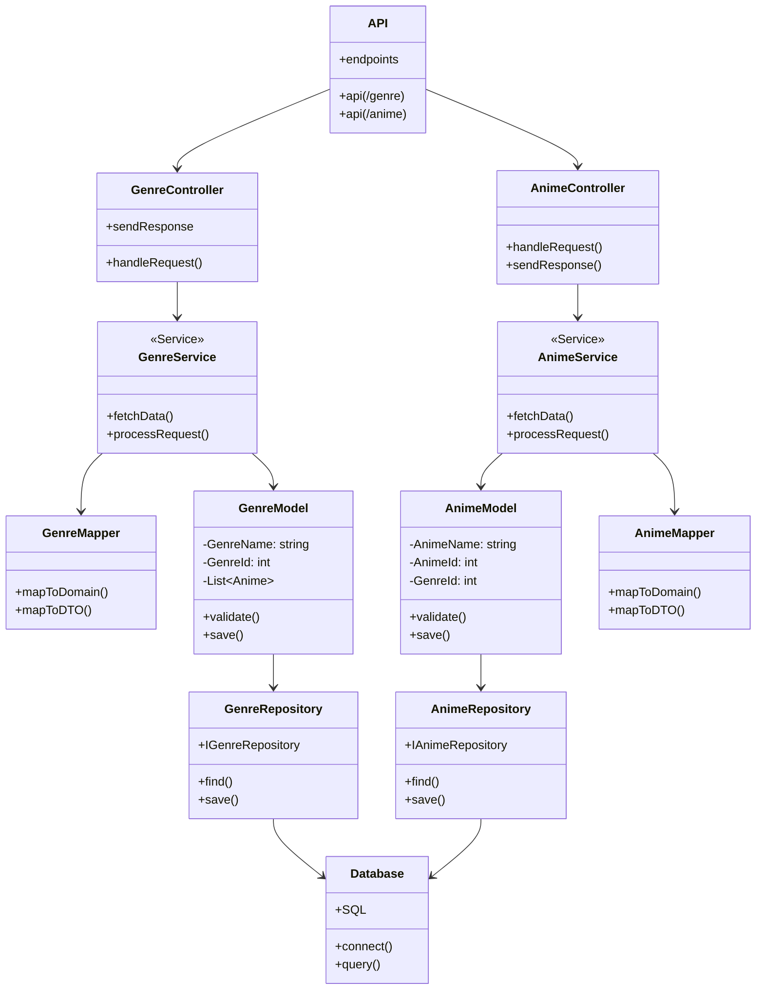

# About Project Anime

This is a project I was assigned for the course I'm taking (KodeHode). It has to be a ASP .NET Core web server that delivers static files from the wwwroot folder.
We could choose the theme for it ourselves, so I just chose one that seemed fun.

## Where I'm at

I'm still figuring out a bit what I want to do with the project. I've been testing out some color palettes and how I want it to look.
I'm also following a [playlist](https://www.youtube.com/playlist?list=PL82C6-O4XrHfrGOCPmKmwTO7M0avXyQKc) to help me with the set up and connecting it to a database. I'm making small changes to fit my code, but I'm waiting with the bigger changes until later so I know what I'm doing a bit better first.

## Diagram
I'm still new to makin diagrams in general, and it's the first time I've really tried mermaid charts... Hopefully I got it somewhat right, though I'm not quite happy myself. I was trying to add a line between the AnimeModel and GenreModel to show that they get some information from eachother, but that completely destroyed the layout and there didn't seem to actually be a way to do it (though it might get added later from what I was able to find)

## Technologies

- Frontend:
  - HTML
  - CSS
  - JS
- Backend:
  - C#
  - ASP .NET Core
  - Extensions -> NuGet Gallery:
    - EF Core Design, Tools & SQL server
    - NewtonSoft Json
    - Swashbuckle
